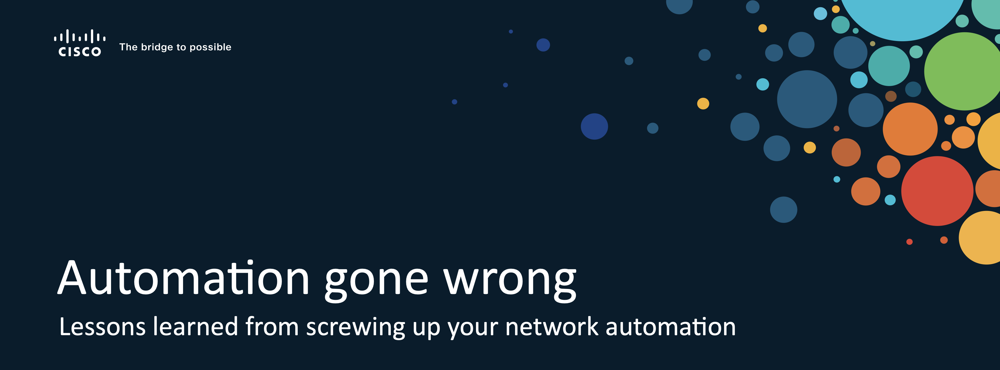

# Cisco Live 2022 - DEVNET-1439 Companion Guide

Welcome to the companion guide for the DEVNET-1439 session at Cisco Live 2022. In this document we want to give you a bit more context around each of the demos shown during the delivery of the session as well as explain the source code or tools used for each of the demos in more depth. 

## Overview

* **Demo 1: Single Source of Truth using GitLab, Templates and Netbox** This demo combines the IPAM system NetBox with the Version Control System git (and it's interface GitLab) and jinja templates to create device-specific configurations based on configuration templates. [To Demo](sections/01-ssot_gitlab_netbox/)
* **Demo 2: Automatic config and unconfig creation with pyATS** This demo leverages the ability of pyATS to generate configuration and unconfiguration files based on python objects. [To Demo](sections/02-config_unconfig/)
* **Demo 3: Verify BGP Neighbor status using pyATS** shows you how to use a pyATS testcase to verify that all BGP neighbors are established. This example shows how you can codify common tests you would normally do manually when troubleshooting or verifying functionality in a network. [To Demo](sections/03-pyats_bgp/)
* **Demo 4: Parallelized configuration pushing using pyATS and RQ** leverages two open source tools, pyATS and RQ, to build a simple parallel configuration delivery functionality that would be capable of, in parallel, push a configuration change to multiple devices. [To Demo](sections/04-parallel_config/)
* **Demo 5: Custom monitoring solution** shows custom monitoring build using Grafana, InfluxDB and Telegraf for IOS XE devices and vManage. This demo is based on the work of Christina Skoglund, Jeremy Cohoe and Eduard Schorning. [To Repo 1](https://github.com/jeremycohoe/cisco-ios-xe-mdt) - [To Repo 2](https://github.com/schornig/viptela-sdwan-stats-collector).
* **Demo 6: Continuous monitoring using pyATS test cases** Our test cases codify and test that our network is in the state we want it to be in. Why only use that after deploys? We can run these tests continuously and have the results be reported back to us via Webex. [To Demo](sections/06-cont_testing/)
* **Demo 7: Continuous change monitoring** All our efforts in building a network automation architecture are for nothing if our engineers keep logging into the devices to do configurations manually. This demo is based on work by Gabi Zapodeanu and shows a simple application that monitors devices for changing configuration and automatically opens up a ticket in service now. [To Repo](https://github.com/zapodeanu/DEVWKS_2840)